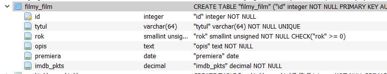
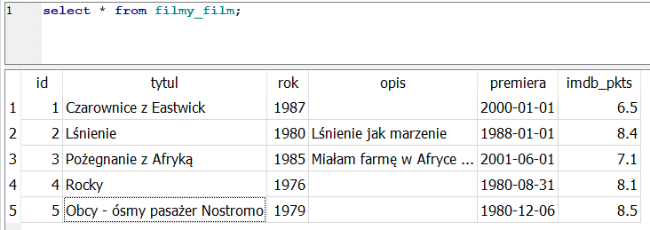

# Zaawansowane aplikacje internetowe

<br>

## Modele

<br>

Informacje o utworzonych modelach przechowywane są w pliku *filmy/models.py*. Każdy model to osobna tabela w bazie danych. Poniżej przedstawiona została zawartość pliku *filmy/models.py*. Składa się na nią jeden model.

<br>

<details>

<summary>Zawartość pliku <b>filmy/models.py</b>:</summary>

<font size="2">

```python
from django.db import models


class Film(models.Model):
    tytul = models.CharField(max_length=64, blank=False, unique=True)
    rok = models.PositiveSmallIntegerField(blank=False)
    opis = models.TextField(default="")
    premiera = models.DateField(null=True, blank=True)
    imdb_pkts = models.DecimalField(max_digits=4, decimal_places=2, null=True, blank=True)
        

    # def __str__(self):
    #    return "{} ({})".format(self.tytul, str(self.rok))


```

</font>

</details>

<br>

## Aktywacja modelu

<br>

Aby poprawnie aktywować utworzony model (klasa <b>Film</b> w pliku *filmy/models.py*) należy w pierwszym rzędzie zarejestrować aplikację *filmy* w pliku *filmweb/settings.py*, następnie przygotować i wykonać migrację aplikacji *filmy*.

1. Rejestracja aplikacji *filmy*

<br>

<details>

<summary>Fragment zawartości pliku <b>filmweb/settings.py</b>:</summary>

<font size="2">

```python
(...)
INSTALLED_APPS = [
    'filmy.apps.FilmyConfig',     # wpis rejestrujący aplikację filmy w settings.py
    'django.contrib.admin',
    'django.contrib.auth',
    'django.contrib.contenttypes',
    'django.contrib.sessions',
    'django.contrib.messages',
    'django.contrib.staticfiles',
]
(...)

```

</font>

</details>

<br>

2a. Przygotowanie ...

<br>

<font size="2">

```python

(env) D:\ZAISTAC2024\ZAITMP> python manage.py makemigrations filmy

```

</font>

<br>

2b. ... i wykonanie migracji aplikacji *filmy*

<br>

<font size="2">

```python

(env) D:\ZAISTAC2024\ZAITMP> python manage.py migrate

```

</font>

<br>

> Migracja spowodowała utworzenie w bazie danych tabeli odpowiadającej klasie *Film* z pliku *filmy/models.py*. Informacje o strukturze klasy *Film* zostały skonwertowane do polecenia SQL tworzącego tabelę. Do prezentacji skutków migracji posłużymy się zewnętrznym narzędziem (<b>DB Browser for SQLite</b>).<br>
- wygenerowane polecenie SQL:<br>

<br>

<font size="2">

```python

CREATE TABLE "filmy_film" (
"id" integer NOT NULL PRIMARY KEY AUTOINCREMENT, 
"tytul" varchar(64) NOT NULL UNIQUE, 
"rok" smallint unsigned NOT NULL CHECK ("rok" >= 0), 
"opis" text NOT NULL, 
"premiera" date NULL, 
"imdb_pkts" decimal NOT NULL)

```

</font>

<br>

- reprezentacja graficzna struktury nowej tabeli, dostarczona przez <b>DB Browser for SQLite</b><br>

<br>



<br>

## ORM ( Object-Relational Mapper )

<br>

Obszerna dokumentacja *Django* obejmująca również *ORM* znajduje się <a href="https://docs.djangoproject.com/en/5.0/ref/models/querysets/" target="_blank">tutaj</a>

<br>

ORM to narzędzie, konwertujące polecenia dotyczące operacji na danych, wyrażane w naszej aplikacji w języku Python, na zapytania SQL, które wykonywane są bezpośrednio w bazie danych, z której korzysta Django. Polecenia ORM wykonywane są w interaktywnej konsoli Django, uruchamianej poleceniem

<br>

<font size="2">

```python

(env) D:\ZAISTAC2024\ZAITMP>python manage.py shell
Python 3.11.0 (main, Oct 24 2022, 18:26:48) [MSC v.1933 64 bit (AMD64)] on win32
Type "help", "copyright", "credits" or "license" for more information.
(InteractiveConsole)
>>> 

```

</font>

<br>

Pracę w konsoli interaktywnej Django musimy rozpocząć od niezbędnych importów. Tutaj zaimportujemy model <b>Film</b> z pliku *models.py* aplikacji *filmy*.

<br>

<font size="2">

```python

>>> from filmy.models import Film

```

</font>

<br>

Następnie zobaczmy listę filmów z bazy danych.

<br>

<font size="2">

```python

>>> Film.objects.all()

<QuerySet [<Film: Film object (1)>, <Film: Film object (2)>, <Film: Film object (3)>, <Film: Film object (4)>, <Film: Film object (5)>]>

```

</font>

<br>

Aby polepszyć czytelność zwracanej informacji, musimy wrócić do modelu <b>Film</b> i tam ustawić reprezentację tekstową obiektów modelu <b>Film</b>.

<br>

<font size="2">

```python

    def __str__(self):
        return "{} ({})".format(self.tytul, self.rok)
        
```

</font>

<br>

Aby efekty tej zmiany były widoczne, trzeba zakończyć pracę w konsoli, uruchomić konsolę ponownie, wykonać niezbędne eksporty i ponownie przywołać listę filmów z bazy danych.

<br>

<font size="2">

```python

>>> exit()  
(env) D:\ZAISTAC2024\ZAITMP>python manage.py shell
>>> from filmy.models import Film
>>> Film.objects.all()            

<QuerySet [<Film: Czarownice z Eastwick (1987)>, <Film: Lśnienie (1980)>, <Film: Pożegnanie z Afryką (1985)>, <Film: Rocky (1976)>, <Film: Obcy - ósmy pasażer Nostromo (1979)>]>
       
```

</font>

<br>

Obiekt *QuerySet* jest iterowalny, zatem zwracany wynik może być czytelniejszy.

<br>

<font size="2">

```python

>>> for f in Film.objects.all():
...     print([f.tytul,f.rok])   
... 
['Czarownice z Eastwick', 1987]
['Lśnienie', 1980]
['Pożegnanie z Afryką', 1985]
['Rocky', 1976]
['Obcy - ósmy pasażer Nostromo', 1979]
>>>
       
```

</font>

<br>

Porównajmy ten wynik z wynikiem zapytania SQL. 

<br>



<br>

Możemy również wybierać filmy z bazy danych według określonych kryteriów. Przykład takiego wyboru zaprezentowano poniżej. Proszę zwrócić uwagę, że wynikiem polecenia jest nadal *queryset*, choć tym razem zawiera pojedynczy obiekt.

<br>

<font size="2">

```python

>>> Film.objects.filter(rok=1967)
<QuerySet [<Film: Sami swoi (1967)>]>
>>>
       
```

</font>

<br>

Co by się stało, gdybyśmy chcieli zobaczyć wszystkie filmy, których rok wydania jest większy niż - powiedzmy -  1970? Ujrzelibyśmy komunikat błędu. Python nie wykonałby takiego wyszukiwania. 

<br>

<font size="2">

```python

>>> Film.objects.filter(rok>=1970)
Traceback (most recent call last):     
  File "<console>", line 1, in <module>
NameError: name 'rok' is not defined   
>>>
       
```

</font>

<br>

Dlatego ORM oferuje specjalną składnię, która pozwala na wykonywanie nawet bardzo skomplikowanych zapytań. Kilka przykładów zastosowań tej składni przedstawionych zostało poniżej. Z następnymi spotkamy się przy omawianiu kolejnych zagadnień dotyczących *Django*.

<br>

<font size="2">

```python


>>> Film.objects.filter(rok__gte=1970)     # rok produkcji filmu nie mniejszy niż 1970
<QuerySet [<Film: Czarownice z Eastwick (1987)>, <Film: Lśnienie (1980)>, <Film: Pożegnanie z Afryką (1985)>, <Film: Rocky (1976)>, <Film: Obcy - ósmy pasażer Nostromo (1979)>]>
>>>

>>> Film.objects.filter(tytul__contains='gna')    # tytuł filmu zawiera ciąg liter 'gna'
<QuerySet [<Film: Pożegnanie z Afryką (1985)>]>
>>>

>>> Film.objects.filter(tytul__contains='nie')     # tytuł filmu zawiera ciąg liter 'nie'
<QuerySet [<Film: Lśnienie (1980)>, <Film: Pożegnanie z Afryką (1985)>]>
>>>

>>> Film.objects.filter(tytul__startswith='Sam')     # tytuł rozpoczyna się od 'Sam'                                                  
<QuerySet [<Film: Sami swoi (1967)>, <Film: Samotność długodystansowca (1962)>]>
>>>    

>>> Film.objects.exclude(tytul__startswith='Sam')    # tytuł filmu NIE rozpoczyna się od 'Sam'
<QuerySet [<Film: Czarownice z Eastwick (1987)>, <Film: Lśnienie (1980)>, <Film: Pożegnanie z Afryką (1985)>, <Film: Rocky (1976)>, <Film: Obcy - ósmy pasażer Nostromo (1979)>]>
>>>


```

</font>

<br>

ORM umozliwia nam również wybieranie pojedynczego filmu z bazy danych. Używamy wówczas metody *.get()*. Poniżej zaprezentowano przykład użycia tej metody. UWAGA! Zwracany jest pojedynczy obiekt, a nie *queryset*.

<br>

<font size="2">

```python

>>> Film.objects.get(id=5)  
<Film: Obcy - ósmy pasażer Nostromo (1979)>
>>>
       
```

</font>

<br>

ORM pozwala nam również na dodanie nowego filmu do bazy danych. Można to zrobić na klika sposobów. My najpierw utworzymy obiekt klasy Film, podając niezbędne atrybuty obiektu, następnie zaś zapiszemy ten obiekt do bazy danych.

<br>

<font size="2">

```python

>>> Film.objects.all().count()                                                      
6                               # liczba filmów w bazie danych 
>>>

>>> f = Film(tytul='Samotność długodystansowca',rok=1962,premiera='1962-12-01',opis='',imdb_pkts=8.5)     # utworzenie obiektu
>>> f.save()                                                                                              # zapis obiektu do bazy danych

>>> Film.objects.all().count()                                                  
7                               # liczba filmów w bazie danych 
>>>

```

</font>

<br>

## Modyfikacja widoków (*views.py*)

<br>

Zmodyfikujemy nasze widoki tak, by zaczęły wyświetlać zawartość bazy danych.

<br>

<details>

<summary>Zmodyfikowana zawartość pliku *filmy/views.py*</summary>

<font size="2">

```python
from django.http import HttpResponse
from filmy.models import Film


def wszystkie(request):
        return HttpResponse(["<h1>",[[f.id, f.tytul, f.rok] for f in Film.objects.all()],"</h1>"])


def szczegoly(request,film_id):
    f = Film.objects.get(id=film_id)
    return HttpResponse("<h3> Tytuł filmu: {},</br> rok produkcji: {}, </br> data premiery: {}, </br> opis: {}, </br> punkty od widzów: {} </h3>"
                        .format(f.tytul,f.rok,f.premiera,f.opis,f.imdb_pkts))

```

</font>

</details>

<br>

Skoro został zmieniony plik *views.py*, należy zmodyfikować plik *filmy/urls.py* w taki sposób, by współpracował z pliem *filmy/views.py*.

<br>

<details>

<summary>Zmodyfikowana zawartość pliku *filmy/urls.py*</summary>

<font size="2">

```python

from django.urls import path
from filmy.views import wszystkie, szczegoly

urlpatterns = [
    path('wszystkie/', wszystkie),
    path('szczegoly/<int:film_id>/', szczegoly)
]


```

</font>

</details>

<br>

## Templates

<br>

Za wyświetlanie danych z bazy danych odpowiedzialne są przede wszystkim szablony (pliki *.html*). Na początek zatem wskazanie, gdzie należy tworzyć i przechowywać owe pliki. Poniżej zamieszczono fragment zawartości pliku *filmweb/settings.py*:

<br>

<font size="2">

```python
TEMPLATES = [
    {
        'BACKEND': 'django.template.backends.django.DjangoTemplates',
        'DIRS': ['templates'],  
# Wpisana nazwa katalogu: templates
```

</font>

<br>

Katalog *templates* został utworzony na tym samym poziomie projektu, co *filmweb* i *filmy*. W katalogu tym należy następnie utworzyć katalogi dla każdej zainstalowanej aplikacji. W naszym przypadku jest to katalog *filmy*, w którym zostały umieszczone niezbędne szablony *.html*.

<br>

Należy teraz zmienić zawartość widoków (funkcji) w pliku *views.py* tak, by wyświetlały zawartości skojarzonych z widokami plików **.html* (szablonów), a nie zajmowały się przetwarzaniem samej listy filmów z bazy danych.

<br>

<details>

<summary>Zmodyfikowana zawartość pliku <b>filmy/view.py</b></summary>

<font size="2">

```python

from django.http import HttpResponse
from django.template import loader
from filmy.models import Film


def wszystkie(request):
    template = loader.get_template("filmy/wszystkie.html")
    wszystkie_filmy = Film.objects.all()
    context = {'wszystkie_filmy':wszystkie_filmy,}
    return HttpResponse(template.render(context, request))

def szczegoly(request,film_id):
    template = loader.get_template("filmy/szczegoly.html")
    film = Film.objects.get(id=film_id)
    context = {'film': film}
    return HttpResponse(template.render(context,request))

```

</font>

</details>

<br>

